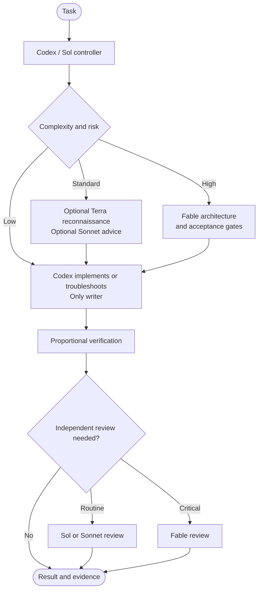

# Codex harness workflow

A portable, Codex-first engineering workflow for macOS, Linux, and WSL. Codex
owns orchestration and implementation. GPT-5.6 Sol handles demanding work,
GPT-5.6 Terra handles bounded reconnaissance, Claude Sonnet 5 supplies routine
independent judgment, and Claude Fable 5 supplies high-risk architecture and
critical review.

The setup also provides local memory through Mempalace, structural code search
through Graphify, and model routing/compression through Headroom. External MCP
services remain on demand so unrelated tool schemas do not consume context.

## How work flows



Codex remains capable of full troubleshooting and repository access under the
permission mode selected for the task. Terra, Sonnet, and Fable are deliberately
read-only because they advise the controller; their restrictions do not limit
Codex from implementing, running diagnostics, or operating approved tools.

## Models and responsibilities

| Role | Model | Responsibility | Access |
|---|---|---|---|
| Controller | GPT-5.6 Sol | Planning, implementation, debugging, verification, live tools, outward actions | Inherits the Codex task permission mode |
| Explorer | GPT-5.6 Terra | Fast, bounded repository reconnaissance | Read-only; no MCP or nested agents |
| GPT reviewer | GPT-5.6 Sol | Independent review when model diversity is unnecessary | Read-only; no MCP or nested agents |
| Advisor | Claude Sonnet 5 | Medium-complexity second opinion and routine review | Read-only; no tools, one turn |
| Architect | Claude Fable 5 | High-risk architecture, replanning, and critical review | Read-only; only Read, Glob, and Grep |

Automatic routing is conservative. Questions, documentation, small mechanical
changes, and latency-sensitive work stay with one Sol controller. A standard run
uses at most two Claude calls. A high-risk run uses at most three. Provider-limit
failures are never retried automatically.

To force the team:

```text
$model-team Diagnose this production race, implement a fix, and prove it.
```

To suppress it for one task:

```text
Use a single agent for this task.
```

Automatic activation is announced before any worker is dispatched, including
the score, material risk dimensions, and selected workers.

## Install

Prerequisites are Git, Python 3.11 or newer, `curl`, `jq`, and a Codex install.
Claude Code is optional for GPT-only operation and required for Sonnet/Fable
workers. No credentials or login state are stored in this repository.

```bash
git clone <repository-url> harness-workflow
cd harness-workflow
./init.sh --codex
```

The installer is backup-first and idempotent. It preserves unrelated Codex and
Claude configuration, credentials, MCP servers, plugins, permissions, project
trust, and hooks. It owns only the files and configuration entries shipped by
this repository.

Useful options:

```bash
./init.sh --help
./init.sh --no-desktop
./init.sh --graphify-repo "$HOME/projects/service-a"
GRAPHIFY_EXTRA_REPOS="$HOME/service-a:$HOME/service-b" ./init.sh
```

There is no required repository parent directory. Pass any repository path to
`--graphify-repo`; the default tracks this repository only.

## Use the workflow

Start Codex normally for everyday work:

```bash
codex
```

For a short self-contained task, use the lightweight profile. It keeps the
safety and routing policy while skipping optional memory and graph maintenance:

```bash
codex --profile fast
```

The controller automatically selects the smallest adequate workflow. Native GPT
workers appear in the Codex Subagents panel. When Sonnet or Fable is active, use
the separate watcher only if you want live detail:

```bash
claude-worker-watch
claude-worker-watch --once
claude-worker-watch --json
```

The watcher reads local sanitized state and consumes no model tokens. It shows
the Claude role, actual model, phase, tool activity, elapsed time, provider
turns, token usage, cache counters, per-call ceiling, and rolling usage guard.

## Verification policy

Verification is proportional rather than ritualistic:

| Risk | Expected evidence |
|---|---|
| Low | Inspect the changed surface and run the single cheapest decisive check |
| Medium | Targeted tests plus the nearest affected integration or syntax boundary |
| High | Relevant regression set plus the rollback, idempotency, security, concurrency, or platform boundary creating the risk |

An unchanged test, doctor, installer, or scan is not repeated unless proving
idempotency or investigating nondeterminism. New scripts and tests are added only
when existing focused checks cannot protect durable behavior.

Run diagnostics directly when troubleshooting the setup:

```bash
./tools/codex/doctor-workflow.sh
./tools/model-team/doctor-model-team.sh
headroom-watch
```

Run focused repository checks while editing the corresponding surface:

```bash
./tools/codex/test-workflow.sh instructions
./tools/codex/test-workflow.sh installer
./tools/model-team/test-model-team.sh
```

Use the full regression path only for cross-cutting changes or before publishing:

```bash
./tools/codex/test-workflow.sh all
./tools/model-team/test-model-team.sh
bash -n init.sh tools/update-versions.sh tools/**/*.sh
```

## Memory and code graph

Mempalace is the durable local memory tier. Codex recalls it only when prior
decisions or repository conventions matter; raw memory drawers are never sent to
workers. Do not run CLI mining while a live MCP-backed session is using the same
palace.

```bash
mempalace search "deployment rollback convention"
mempalace status
```

Graphify provides persistent structural repository context. If
`graphify-out/graph.json` exists, the workflow queries it before broad source
scans. Register repositories during installation or reseed them explicitly:

```bash
./tools/graphify/graphify-reseed.sh /path/to/repository
./tools/graphify/reseed-verify.sh /path/to/repository
```

Generated graph files and machine-local memory remain outside version control.

## Headroom routing

The installer configures both provider base URLs through the local Headroom
proxy at `127.0.0.1:8787`. Claude workers inherit
`ANTHROPIC_BASE_URL=http://127.0.0.1:8787`; OpenAI-compatible traffic uses
`OPENAI_BASE_URL=http://127.0.0.1:8787/v1` where the active Codex transport
supports it. ChatGPT subscription/backend traffic may remain native to Codex.

Headroom runs with `--no-cache`, which disables local full-response replay. This
does not disable provider-side prompt caching. Mempalace stores durable semantic
memory; prompt caching only avoids reprocessing repeated prompt prefixes, so the
two mechanisms do not conflict.

```bash
headroom-watch
headroom perf
curl -fsS http://127.0.0.1:8787/health
```

## External MCP tools

Live-service MCPs are deliberately on demand. Normal repository work does not
load their full schemas. When a task requires an external service, Codex uses the
configured MCP entry and retains ownership of reads, writes, permissions, and
ambiguous-action handling. Workers receive only immutable distilled snapshots.

The installer preserves an existing Docker MCP gateway and narrows its initial
surface to dynamic discovery where supported. It does not require a particular
Docker profile and skips optional Docker integration cleanly when unavailable.

## Platforms

`init.sh` supports macOS, Linux, and WSL.

- macOS uses `launchd` user agents.
- Linux uses `systemd --user` when available.
- On WSL, it uses `systemd --user` when available and otherwise prints manual service commands.
- The optional Windows Codex App bridge renders WSL-aware hook and MCP commands without copying Linux-specific configuration into the Windows Codex home.

Repository locations are discovered or explicitly supplied; nothing requires
projects to live under `~/code` or another fixed directory.

## Tool versions

The bootstrap uses reviewed version pins for reproducibility. A scheduled GitHub
workflow checks current PyPI releases and opens a review PR rather than silently
upgrading machines.

| Tool | Pinned version |
|---|---:|
| Headroom | 0.31.0 |
| Mempalace | 3.5.0 |
| Graphify | 0.9.16 |

Check or apply available versions locally:

```bash
./tools/update-versions.sh --check
./tools/update-versions.sh --apply
```

## Repository map

| Path | Purpose |
|---|---|
| `codex/` | Principal-level instructions, native agent profiles, hooks, fast profile, and references |
| `claude/` | Direct Claude Code settings, status line, and optional review workflow |
| `workflow/` | Shared hooks and on-demand skills installed into Codex |
| `tools/model-team/` | Bounded Claude MCP bridge, usage guard, watcher, installer, doctor, and focused tests |
| `tools/codex/` | Portable Codex discovery, installation, diagnostics, platform support, and regression tests |
| `tools/headroom/` | Proxy services, health watcher, and opt-in canary |
| `tools/mempalace/` | Snapshot, pruning, recovery, and lifecycle helpers |
| `tools/graphify/` | Graph generation, reseeding, and verification helpers |

Design artifacts under `docs/`, generated graphs, credentials, backups, and
machine-local state are ignored and must never be committed.
