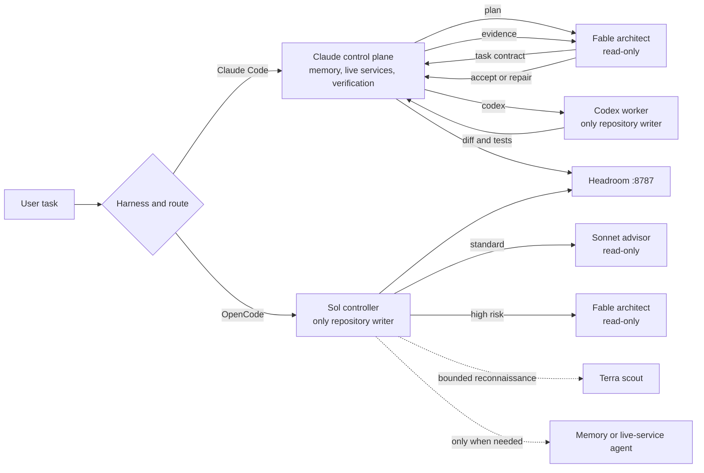

# Harness Workflow

A portable, single-writer development workflow for Claude Code, Codex, and
OpenCode. It combines automatic model routing, local memory, code-graph search,
context optimization, isolated workers, and observable review loops without
replacing personal credentials or configuration.

## Quick start

```bash
git clone <this-repo> harness-workflow
cd harness-workflow
./init.sh
claude
```

`init.sh` supports macOS and Linux, detects Codex and OpenCode when installed,
and safely skips optional harnesses that are absent. Use `./init.sh --codex` when
Codex is required and setup should fail if it cannot be found.

After installation:

```bash
./tools/codex/doctor-workflow.sh
./tools/model-team/doctor-model-team.sh
./tools/opencode/doctor-workflow.sh       # only when OpenCode is installed
```

Start a new terminal session after installation so updated commands and
configuration are loaded.

## How the workflow runs



The Claude path uses Claude as the control plane, a resumable Fable architect
for planning and review, and a Codex MCP worker for implementation. Repairs use
`codex-reply` on the original process-local worker thread.

The OpenCode path keeps Sol as the only writer. It automatically routes medium work through Sonnet 5
and high-risk work through Fable 5. Terra handles bounded
read-only reconnaissance. Memory and live-service MCP schemas are exposed only
through on-demand subagents, keeping ordinary build turns smaller.

All configured Claude, Codex, and OpenCode model traffic goes through the local
Headroom proxy. Mempalace recall and Graphify queries operate on local data.

## Automatic routing

Both model-team implementations score the same six dimensions from 0 to 2:
scope, coupling, ambiguity, blast radius, reversibility, and verification.

| Score | Route | Behavior |
|---:|---|---|
| 0-2 | Inline | The primary harness handles the task without a model team |
| 3-6 | Standard | Plan or advise, implement with one writer, then run one focused review |
| 7-12 | High risk | Use architecture review, optional bounded reconnaissance, strict evidence review, and the high-severity repair gate |

Security, authentication, data migration, concurrency, production deployment,
irreversible changes, cross-system architecture, and ambiguous high-impact
failures always use the high-risk route.

| Control | Claude Code | OpenCode |
|---|---|---|
| Automatic | Enabled for qualifying implementation work | Enabled for medium and high work |
| Force on | `/model-team <task>` | `/team <task>` |
| Force off | `use a single agent` | `use a single agent` |

Force-on commands activate at least the standard route without artificially
inflating the score. The explicit single-agent instruction always wins.
Questions, routine advice, small mechanical changes, documentation-only work,
and latency-sensitive requests normally remain inline.

## Daily use

Use Claude Code normally. Automatic routing announces the score and reason
before dispatching workers. To force the team for a specific task:

```text
/model-team Diagnose this production race and implement a verified fix.
```

Use OpenCode normally with the default `build` agent. To force its team:

```text
/team Refactor this authentication flow and verify the migration path.
```

For a task where latency matters more than independent review:

```text
Use a single agent. Update this typo and run the focused check.
```

### Roles and boundaries

| Role | Model | Responsibility |
|---|---|---|
| Claude control plane | Current Claude session | Recall, live services, orchestration, independent verification, and outward actions |
| Fable architect | `fable` | Read-only planning, decomposition, replanning, and evidence-based review |
| Codex worker | Configured Codex default | `danger-full-access`, approval policy `never`, implementation and verification |
| OpenCode controller | `openai/gpt-5.6-sol` | Only writer in OpenCode; owns the actual diff and tests |
| OpenCode scouts | `openai/gpt-5.6-terra` | Bounded repository or official-documentation reconnaissance |
| OpenCode support agents | `openai/gpt-5.6-terra` | Bounded reconnaissance, memory recall, and on-demand MCP access without loading those schemas into normal turns |

The Codex worker uses an isolated per-process `CODEX_HOME` with zero inner MCP servers
or plugins. It links the existing login and retains only model routing,
reasoning, Headroom, and full-access safety settings. Only one writer may run at
a time; nested model-team invocation is forbidden.

The OpenCode Claude worker starts with `--safe-mode`, no user plugins or hooks,
and no MCP servers. Default per-call spend ceilings are USD 4 for advice, USD 3
for routine review, USD 8 for architecture, and USD 6 for critical review.
Environment variables named `CLAUDE_WORKER_<ROLE>_BUDGET_USD` can override them.

## Tool guide

`init.sh` installs daily commands into `~/.local/bin`. Repository-relative
commands below can be run directly from this checkout.

### Observe model activity

```bash
model-team-watch
model-team-watch --once
model-team-watch --json --repo /path/to/repository
```

Use `model-team-watch` while Claude is orchestrating Codex. `ACTIVE` means an
instrumented `codex` or `codex-reply` call is currently in flight. `READY` and `IDLE`
mean the MCP server is available but not working. The display includes
the current orchestration phase, actor, task, repository, and Git state; ordinary
Codex Desktop requests are excluded.

```bash
headroom-watch
headroom-watch --once
headroom-watch --raw
headroom perf
```

Use `headroom-watch` for the machine-wide view of models, completed requests,
cache behavior, and compression. Use `--raw` when diagnosing the underlying
`/stats` payload. `headroom perf` reports historical token and latency results.
It is not an in-flight Codex-worker monitor.

### Diagnose an installation

```bash
./tools/codex/doctor-workflow.sh
./tools/model-team/doctor-model-team.sh
./tools/opencode/doctor-workflow.sh
```

- The Codex doctor checks installed instructions, hooks, routing, optional live
  service access, Mempalace, Graphify, and repository state.
- The model-team doctor checks the Fable architect, isolated worker, permissions,
  Headroom health, Mempalace availability, and token-free MCP handshakes.
- The OpenCode doctor checks agents, worker isolation, merged configuration,
  Headroom routing, optional MCP availability, and plugin loading.

Treat `FAIL` as broken setup. `WARN` identifies optional capability or local
maintenance; read the doctor's final next action before changing configuration.

### Query and refresh Graphify

Create a repository graph through Claude Code:

```text
/graphify .
```

Use the local graph before broad source scans whenever
`graphify-out/graph.json` exists:

```bash
graphify query "Where is authentication configured?"
graphify path "request handler" "database client"
graphify explain "deployment pipeline"
graphify update .
```

- `query` returns the scoped subgraph relevant to a question.
- `path` traces relationships between two concepts.
- `explain` focuses on one concept and its neighborhood.
- `update` performs a local AST refresh after source changes. It does not name
  new communities.

For a complete named map during a live Claude/Mempalace session:

```bash
graphify-sync.sh /path/to/repository
reseed-verify.sh /path/to/repository
```

These commands label and stage reports but do not write to Mempalace. For every
successful `MINE wing=... source=...` line, ask the active agent to mine that
source through the already-running Mempalace MCP. Never start a second CLI
palace writer during a live MCP-backed session.

The standalone replacement path is strictly out of session:

```bash
graphify-reseed.sh /path/to/repository
```

It snapshots the palace, replaces structural wings, and refuses to proceed when
a Mempalace MCP process is live. Use it only when Claude, Codex, OpenCode, and
other Mempalace clients are closed.

### Recall and maintain Mempalace

Search durable memory when a task depends on earlier work or conventions:

```bash
mempalace search "model-team worker isolation"
```

Seed a new palace once, outside an active MCP-backed session:

```bash
mempalace init "$HOME"
mempalace mine ~/.claude/projects/ --mode convos
```

Maintenance is scheduled by `init.sh`, but can be run manually:

```bash
mempalace-snapshot.sh
~/.local/share/uv/tools/mempalace/bin/python ~/.local/bin/mempalace-prune.py --dry-run
```

`mempalace-snapshot.sh` creates and verifies an online SQLite backup. Always run
the pruner with `--dry-run` first; omit it only after reviewing the candidates.
Recovery and single-writer procedures are in
[`codex/references/memory-tooling.md`](codex/references/memory-tooling.md).

### Run advanced maintenance

After Claude installs or updates the Mempalace plugin, reapply the local hook
hardening:

```bash
mempalace-stop-timeout.sh 90
mempalace-stop-detach.sh
```

Both commands are idempotent, and `init.sh` already runs them best-effort. The
first raises the Stop-hook safety timeout; the second prevents overlapping
Mempalace writers and removes Stop-hook latency from normal turns.

For the repository set used by this personal workflow, preview a bulk Graphify
refresh before allowing it to update configuration or memory:

```bash
./tools/graphify/refresh-structural-memory.sh --dry-run
./tools/graphify/refresh-structural-memory.sh
```

This helper discovers only the repository roots declared in its `--help`
output. Run it outside active Mempalace sessions; never add
`--stop-live-mempalace` merely to bypass its writer guard.

Component installers, MCP wrappers, service definitions, protocol smoke tests,
and `patch-divergence-threshold.sh` are implementation internals. Use
`./init.sh` to reconcile them. Run the doctor and test commands above to inspect
or verify them instead of invoking those files directly.

### Validate repository changes

```bash
./tools/codex/test-workflow.sh all
./tools/model-team/test-model-team.sh all
./tools/opencode/test-workflow.sh all
git diff --check
```

The suites use isolated temporary homes and fake MCP/model binaries where
possible. They validate portability, preservation, idempotency, worker
protocols, routing, watchers, and failure behavior without spending model
tokens. The same checks run in `.github/workflows/verify.yml`.

## Installation contract

`init.sh` installs pinned defaults:

| Tool | Default version | Purpose |
|---|---:|---|
| Headroom | 0.31.0 | Local routing, cache optimization, and traffic statistics |
| Mempalace | 3.5.0 | Durable local memory and MCP recall |
| Graphify | 0.9.16 | Per-repository structural knowledge graph |

Versions can be overridden with `HEADROOM_VERSION`, `MEMPALACE_VERSION`, and
`GRAPHIFY_VERSION`. Matching installations are not upgraded or reinstalled.

Check official PyPI releases without changing the repository, or advance every
synchronized pin locally:

```bash
./tools/update-versions.sh --check
./tools/update-versions.sh --apply
```

The updater changes `init.sh`, this version table, and the corresponding
regression assertions together. A weekly GitHub workflow performs the same
update, smoke-tests each candidate in isolated uv tool homes, runs all workflow
suites, and opens a review PR when versions changed. It never auto-merges.

Run the scheduled path on demand with:

```bash
gh workflow run update-tool-versions.yml
```

The repository's Actions settings must permit workflows to create pull
requests. If that policy is disabled, use `--check` and `--apply` locally.

The installer:

- merges repo-owned Claude settings and a marked global-instruction block;
- preserves unrelated permissions, credentials, plugins, hooks, MCPs, provider
  settings, projects, trust state, and personal instructions;
- discovers Codex through `PATH`, `CODEX_BIN`, and supported app bundles;
- installs OpenCode integration only when OpenCode already exists;
- renders machine-specific paths while keeping portable defaults in the repo;
- uses `launchd` on macOS and `systemd --user` on Linux;
- backs up only changed files and keeps the newest five `bak-init` snapshots;
- is safe to rerun and performs no commit, push, or branch creation.

Useful installer options:

```bash
./init.sh --help
./init.sh --codex
./init.sh --no-desktop
./init.sh --graphify-repo "$HOME/project-a" --graphify-repo "$HOME/project-b"
GRAPHIFY_EXTRA_REPOS="$HOME/project-a:$HOME/project-b" ./init.sh
```

## Memory and code intelligence

Mempalace is the durable memory tier. Claude owns recall during Claude-led
model-team runs and passes no more than five distilled bullets to workers.
OpenCode dispatches its memory agent only when prior work or conventions matter.
Raw drawers, transcripts, reasoning, credentials, and unbounded tool output are
never forwarded between models.

Graphify is repository-scoped. Its generated `graphify-out/` directory is
globally ignored and never belongs in a commit. Query and update are local;
semantic extraction and community naming can consume model tokens.

## Headroom and token visibility

The installed routes are:

| Client | Route |
|---|---|
| Claude Code and Graphify model work | `ANTHROPIC_BASE_URL=http://127.0.0.1:8787` |
| Codex, OpenCode, and their workers | `OPENAI_BASE_URL=http://127.0.0.1:8787/v1` |

The default proxy uses cache mode to preserve stable prefixes for provider-side
KV-cache hits. Its separate local response cache is disabled with `--no-cache`
so an identical troubleshooting prompt cannot replay a stale model response
after repository or live state changes. Mempalace remains the only durable
memory owner.

Claude tool search defers MCP schemas, Codex exposes only its bounded dynamic
management surface, and OpenCode keeps memory and live-service schemas behind
on-demand agents. OpenCode routes OpenAI traffic through Headroom and gives its
Claude worker the matching Anthropic endpoint.

Test lossless tool-result interception separately:

```bash
headroom-canary
```

The canary starts a token-mode proxy on `127.0.0.1:8788`, logs aggregate request
metadata under `~/.headroom/logs/canary.jsonl`, and never replaces the default
`:8787` service. Point only a disposable session at it and watch that proxy from
another terminal:

```bash
HEADROOM_URL=http://127.0.0.1:8788 headroom-watch
```

Compare its live statistics with the default proxy, inspect `canary.jsonl` when
needed, then stop the canary with `Ctrl+C`. `headroom perf` reads the default
`proxy.log`; it does not include the separate canary log.

Claude-worker results include per-call model usage and cost when Claude reports
them. Exact Codex-worker token attribution is unavailable because Headroom
statistics are shared across machine traffic; do not infer it from nearby
timestamps.

## Verification

A real end-to-end worker check consumes model tokens. After the doctors and
regression suites pass, start a fresh Claude Code process and run:

```text
/model-team Inspect this repository read-only and report its current branch.
```

A healthy run shows the automatic route announcement, Fable plan, `Calling
codex-worker`, review, and completion receipt. In another terminal,
`model-team-watch` should transition through the matching phases and show an
`ACTIVE` call only while the worker is running.

## Safety and limitations

- Codex full access is intentional for hardcore troubleshooting. The controller
  announces it before dispatch, and the worker is the only writer.
- Worker thread IDs are valid only while the owning MCP server process remains
  alive. Finish repair rounds in the same run.
- One repair round is normal. A second is allowed only for a confirmed critical
  or high-severity finding.
- Headroom statistics are machine-wide; use the instrumented worker watcher for
  actual Codex-worker activity.
- `headroom-canary` is experimental and opt-in.
- Never run CLI `mempalace mine` or `graphify-reseed.sh` while Mempalace MCP is
  live.
- No secrets, tokens, credentials, memory databases, generated graphs, or local
  `docs/` design files are tracked by this repository.
