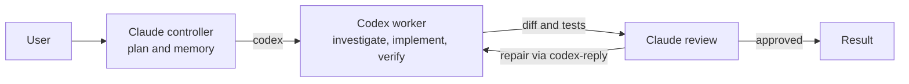

# Harness Workflow

A portable Claude Code and Codex workflow with local memory, code-graph search,
context compression, and an optional multi-model implementation loop.

## Quick start

```bash
git clone <this-repo> harness-workflow
cd harness-workflow
./init.sh
claude
```

`init.sh` is backup-first, idempotent, and supports macOS and Linux. Sign in to
Claude Code interactively on first launch. Use `./init.sh --codex` to require
Codex; otherwise Codex and model-team are installed only when the executable is
found on `PATH`, through `CODEX_BIN`, or in a supported macOS app bundle.

## Architecture

### Traffic routing

| Client | Local route | Destination |
|---|---|---|
| Claude Code and Graphify model work | `ANTHROPIC_BASE_URL` -> Headroom `:8787` | Claude backend |
| Codex CLI and `codex-worker` | `OPENAI_BASE_URL` -> Headroom `:8787/v1` | Native Codex backend |
| Mempalace recall and Graphify queries | Local process and local data | No model request |

Headroom is the shared routing and context-compression layer for configured Claude
and Codex model traffic. Mempalace owns durable local recall. Graphify owns the
per-repository code graph.

### Model-team lifecycle



Claude is the control plane. Codex is the repository worker. A repair continues
the original Codex thread with `codex-reply`; it does not create another writer.

## Installation contract

`init.sh` installs or reconciles these layers:

| Layer | Installed behavior |
|---|---|
| Claude Code | Settings, global instructions, lifecycle hooks, status line, workflows, and plugin declarations under `~/.claude` |
| Headroom | `headroom-ai[proxy]`, `headroom-watch`, and an auto-starting service on `127.0.0.1:8787` |
| Mempalace | Local CLI/MCP, recall hooks, health checks, and scheduled maintenance |
| Graphify | CLI, global skill, local-query hooks, and optional graph-to-memory reseeding |
| Codex | Shared hooks, skills, instructions, references, environment routing, and `~/.codex/fast.config.toml` |
| Model team | `model-team` skill, the user-scoped `codex-worker` MCP registration, permissions, diagnostics, and `model-team-watch` |
| OpenCode | Its workflow adapter and local MCP integrations, only when OpenCode is already installed |

Unrelated Codex credentials, plugins, MCP profiles, trust state, projects, and
skills are preserved. Claude's `settings.local.json` is backed up and replaced by
the repository's personal allowlist; review its host-specific entries before using
this as a generic team baseline. Services use `launchd` on macOS and
`systemd --user` on Linux.

## Model-team activation

| Mode | Behavior |
|---|---|
| Explicit on | `/model-team <task>` always activates the workflow |
| Automatic | Activates for architecture, migrations, security, authentication, concurrency, deployment, ambiguous production debugging, token-heavy investigation, multi-component work, or at least two independent bounded subtasks |
| Explicit off | `use a single agent` disables model-team for the current task |
| Single-agent default | Questions, ordinary read-only advice, small mechanical or documentation changes, and latency-sensitive work stay inline |

Automatic activation is announced with a reason before the worker is dispatched.
Nested model-team runs and concurrent writers are forbidden.

### Roles and permissions

| Role | Model selection | Access and ownership |
|---|---|---|
| Claude controller | Configured Claude/Fable path | Planning, Mempalace recall, review, and outward actions |
| Optional reconnaissance | Terra when available | Read-only and skippable; never substituted through another bridge |
| Codex implementation worker | Machine's configured default Codex model | `danger-full-access`, approval policy `never`, and the only repository writer |
| Final review | Focused Fable pass | Reviews the real diff and test evidence without editing |

Claude passes at most five distilled memory bullets, never raw drawers,
transcripts, or credentials. Repairs reuse the same process-local thread: one
round normally, and a second only for a confirmed high-severity finding.

## Verify and observe

Run the token-free doctors and repository regression suites:

```bash
./tools/codex/doctor-workflow.sh
./tools/model-team/doctor-model-team.sh
./tools/codex/test-workflow.sh all
./tools/model-team/test-model-team.sh all
```

The Codex worker is an MCP process, not a Claude subagent, so it does not appear
in Claude Code's agents pane. During a dispatch Claude shows `Calling
codex-worker`; press `Ctrl+O` to expand the tool call. The model-team skill also
prints `MODEL-TEAM DISPATCH`, `MODEL-TEAM REVIEW`, and `MODEL-TEAM COMPLETE`
receipts.

Use the dashboards from another terminal:

```bash
model-team-watch                 # live worker availability, recent requests, and Git activity
model-team-watch --once          # one human-readable snapshot
headroom-watch                   # live routing and compression statistics
headroom-watch --once            # one snapshot
```

`codex-worker UP` means the MCP server is available; it may be idle. The latest
request timestamp and `requests/5m` prove recent completed Codex traffic.
`headroom-watch` reports the latest completed request across clients and aggregate
compression; it is not an in-flight worker monitor. Run `model-team-watch --help`
for JSON output, worktree selection, and refresh controls.

After running `init.sh`, start a fresh Claude Code process and force a small live
check:

```text
/model-team Inspect this repository read-only and report its current branch.
```

A working run shows dispatch, `Calling codex-worker`, recent watcher activity,
review, and completion. Unlike the doctors, this check consumes model tokens.

## Memory and code intelligence

### Mempalace

Mempalace is the durable local memory tier. Its plugin captures sessions; hooks
inject project context and relevant verbatim recall. Claude owns recall during
model-team runs.

Seed a new machine once, outside an active MCP-backed session:

```bash
mempalace init "$HOME"
mempalace mine ~/.claude/projects/ --mode convos
```

Recall is local; the embedding model downloads on first use. Health, corruption
recovery, reseeding, and single-writer procedures live in
[`codex/references/memory-tooling.md`](codex/references/memory-tooling.md).

### Graphify

Graphs are per repository and created on demand:

```bash
/graphify .            # build or refresh through Claude Code
graphify update .      # incremental local AST refresh
graphify query "..."   # local graph traversal
```

Semantic builds can use model tokens; update and query are local. Search redirection
activates only when `graphify-out/graph.json` exists. The output directory is
globally ignored by Git.

Add extra repositories to the Graphify-to-Mempalace reseed list without editing
the installer:

```bash
./init.sh --graphify-repo "$HOME/project-a" --graphify-repo "$HOME/project-b"
GRAPHIFY_EXTRA_REPOS="$HOME/project-a:$HOME/project-b" ./init.sh
```

## Optional OpenCode integration

If OpenCode is present, `init.sh` installs its read-only consultation adapter and
local Mempalace/Headroom MCPs without changing providers, credentials, or models.

```bash
npm install -g opencode-ai
./init.sh
```

Restart OpenCode, then use `/consult <question>`. The higher-cost `fable-review`
workflow remains opt-in for unusually risky final reviews.

## Requirements and safety

Required commands are `git`, `curl`, `jq`, and `uv`; `init.sh` can install `uv`
interactively. Claude Code is installed separately. Codex and OpenCode are optional.

- No secrets, OAuth tokens, API keys, credentials, or memory databases are stored
  in the repository.
- Installation is backup-first and idempotent. By default, the five newest
  `bak-init` snapshots for each managed path are retained.
- Codex full-access execution is intentional for hardcore troubleshooting. The
  controller announces it before dispatch, and only one writer is allowed.
- `init.sh` does not commit, push, or create branches.

## Design references

- [Codex setup optimization](docs/superpowers/specs/2026-07-14-codex-setup-optimization-design.md)
- [Portable Claude-Codex model team](docs/superpowers/specs/2026-07-15-portable-model-team-design.md)
- [Model-team observability](docs/superpowers/specs/2026-07-15-model-team-observability-design.md)
